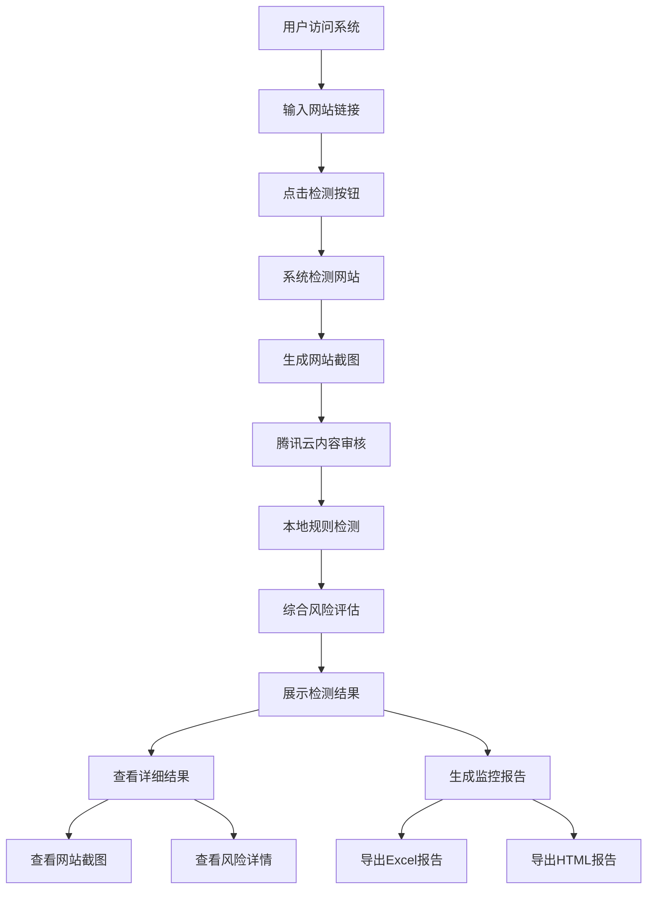

# 网站链接监控系统PRD

## 1. 产品概述
网站链接监控系统是一个用于检测和评估网站安全性的工具，主要用于监控友情链接的合规性。
- 主要功能包括网站内容检测、风险评估、截图生成和监控报告生成，解决网站安全监控的问题，目标用户为网站管理员和安全审计人员。
- 产品价值在于帮助用户及时发现并处理存在安全风险的网站链接，保障网站运营安全。

## 2. 核心功能

### 2.1 用户角色
| 角色 | 注册方式 | 核心权限 |
|------|---------------------|------------------|
| 管理员 | 无需注册 | 访问所有功能，执行网站检测，查看检测结果 |

### 2.2 功能模块
1. **检测页面**：链接输入、批量检测、实时检测结果展示
2. **结果详情**：风险评估详情、违规内容分析、截图查看
3. **监控报告**：批量检测报告、Excel和HTML格式导出

### 2.3 页面详情
| 页面名称 | 模块名称 | 功能描述 |
|-----------|-------------|---------------------|
| 检测页面 | 链接输入区 | 支持单个链接输入和批量链接导入，提供检测按钮 |
| 检测页面 | 结果展示区 | 实时显示检测结果，包括风险等级、风险分数、风险因素 |
| 结果详情 | 风险分析 | 展示详细的风险评估结果，包括腾讯云检测结果和本地规则检测结果 |
| 结果详情 | 截图查看 | 提供网站截图查看功能，支持点击放大查看 |
| 监控报告 | 报告生成 | 支持生成Excel和HTML格式的监控报告，包含详细的检测结果 |

## 3. 核心流程
用户使用网站链接监控系统的主要流程如下：
1. 用户访问系统首页，在链接输入区输入要检测的网站链接
2. 点击检测按钮，系统开始对网站进行检测
3. 系统自动执行以下操作：
   - 检查网站可访问性
   - 生成网站截图
   - 使用腾讯云API进行内容审核（图片和文本）
   - 应用本地规则进行辅助检测
   - 综合评估风险等级
4. 检测完成后，系统在结果展示区显示检测结果
5. 用户可以点击查看详情，查看更详细的风险分析和网站截图
6. 用户可以选择生成监控报告，导出检测结果

## 4. 用户界面设计
### 4.1 设计风格
- 主色调：#4A90E2（蓝色）、#50E3C2（绿色）
- 辅助色：#F5A623（黄色）、#D0021B（红色）
- 按钮样式：圆角按钮，悬停效果
- 字体：系统默认字体，标题16-20px，正文14px
- 布局风格：卡片式布局，响应式设计
- 图标风格：简约线性图标，搭配适当的emoji

### 4.2 页面设计概览
| 页面名称 | 模块名称 | UI元素 |
|-----------|-------------|-------------|
| 检测页面 | 链接输入区 | 文本输入框（支持多行输入），蓝色检测按钮，导入文件按钮 |
| 检测页面 | 结果展示区 | 卡片式列表，每个卡片包含网站名称、URL、风险等级（颜色编码）、风险分数 |
| 结果详情 | 风险分析 | 详情面板，包含风险因素列表、腾讯云检测结果、本地检测结果 |
| 结果详情 | 截图查看 | 缩略图展示，点击弹出模态框查看大图 |
| 监控报告 | 报告生成 | 导出按钮（Excel和HTML），报告预览区域 |

### 4.3 响应式设计
- 桌面优先设计，支持移动端自适应
- 在移动设备上，卡片布局调整为单列显示
- 触控优化，确保按钮和可点击元素大小适合触摸操作

## 5. 技术实现要点
### 5.1 核心技术栈
- 后端：Python Flask
- 前端：HTML、CSS、JavaScript、Bootstrap
- 外部服务：腾讯云内容安全API
- 截图工具：Selenium
- 数据处理：Pandas（用于生成Excel报告）

### 5.2 关键功能实现
- **内容检测**：优先使用腾讯云API进行图片和文本审核，本地规则作为辅助
- **风险评估**：基于腾讯云检测结果和本地规则，综合计算风险分数
- **截图生成**：使用Selenium进行网站截图，失败时生成占位图
- **报告生成**：支持Excel和HTML格式的监控报告

### 5.3 性能优化
- 多线程并行检测，提高批量检测效率
- 截图生成优化，增加超时时间和错误处理
- 缓存机制，减少重复检测

### 5.4 安全考虑
- 输入验证，防止恶意输入
- API密钥安全管理
- 异常处理，确保系统稳定运行